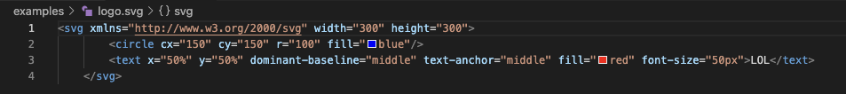

# SVG Logo Creator

## Description

This NodeJS project was created to help users create a quick and simple logo using an svg file.  It allows the user to select a shape as well as 3 characters to be added to the center of that shape along with colors for both the shape and text.  After the user has selected their criteria, the app will produce a logo.svg file for the user to use.

## Table of Contents

- [Installation](#installation)
- [Usage](#usage)
- [Credits](#credits)
- [License](#license)

## Installation

N/A

## Usage

This app uses the terminal.  Simply navigate to the folder and type "node index.mjs" to start the app.  Select which shape you wish to use with the spacebar and press enter.  Next, enter input for each of the prompts.  Upon completing the prompts, the logo.svg file will be added to the examples folder.  Navigate to the new file to view the logo created!

Terminal

Generated SVG code

SVG file in browser

## Credits

npm packages:
- inquirer
- jest

## License

Please view the license in the repository

## Tests

Test file is located in lib folder as shapes.test.js.  To run, type in the terminal "npm run test".  Three tests will be ran testing the render function for each class.  All tests should pass.